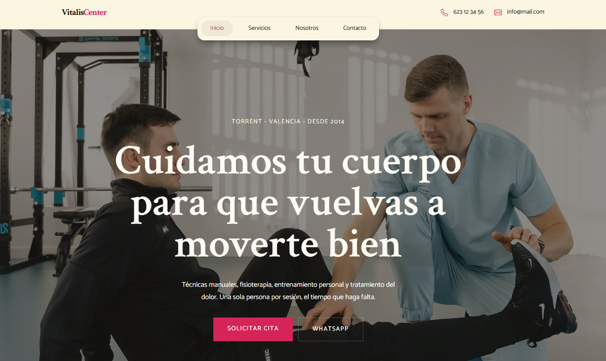
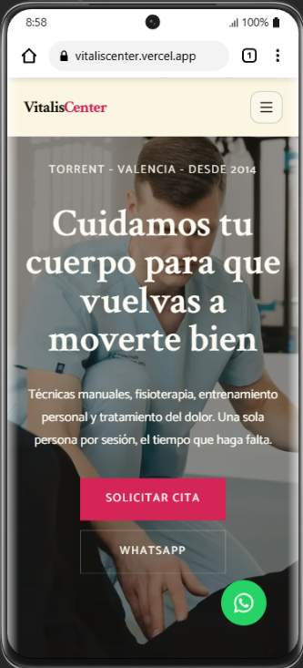

# VitalisCenter

Web para una clínica de fisioterapia, desarrollada como proyecto freelance de principio a fin: análisis, dirección visual, diseño, sistema de componentes y desarrollo.

El objetivo fue evitar la estética habitual del sector (blanco y azul, tarjetas genéricas, fotografía de stock) y construir una web editorial, cálida y tranquila que transmita confianza y cercanía.

- **Web:** [vitaliscenter.vercel.app](https://vitaliscenter.vercel.app/)
- **Repositorio:** [github.com/Pablo-Zallio-Dev/vitaliscenter](https://github.com/Pablo-Zallio-Dev/vitaliscenter)




## Páginas y funcionalidades

- **Inicio**, **Servicios**, **Nosotros** y **Contacto**.
- Formulario de contacto.
- Llamada a la acción con enlace directo a WhatsApp.
- Mapa con la ubicación de la clínica.
- Diseño responsive, pensado primero para móvil.

## Stack

| Área | Tecnología |
| --- | --- |
| Framework | Next.js 16 (App Router) |
| UI | React 19 |
| Lenguaje | TypeScript |
| Estilos | Tailwind CSS 4 |
| Formularios | React Hook Form |
| Estado | Zustand |
| Animaciones | Motion |
| Iconos | React Icons |
| Gestor de paquetes | pnpm |
| Despliegue | Vercel |

## Decisiones principales

- **Dirección visual editorial.** Fotografía protagonista, paleta cálida, tipografía con personalidad, mucho espacio y composición asimétrica, buscando referencias también fuera del sector sanitario.
- **Mobile first.** Cada sección se construye primero para pantallas pequeñas y se amplía progresivamente a tablet y desktop. En el hero se usan imágenes distintas para móvil y desktop, pensadas para el espacio de cada uno.
- **Sistema de componentes con Atomic Design.** En lugar de maquetar cada página como un bloque independiente, la interfaz se compone de átomos, moléculas y organismos reutilizables.
- **Diseño con ayuda de IA.** El diseño de la interfaz se trabajó en Figma apoyándose en herramientas de IA. El desarrollo es propio.

## Estructura del proyecto

```
app/
├── components/
│   ├── atoms/        # botones, tipografía, iconos, inputs
│   ├── molecules/    # tarjetas, items de navegación, campos de formulario
│   └── organisms/    # cabecera, secciones completas, footer
└── page.tsx
```

## Empezar en local

Requisitos: Node.js y [pnpm](https://pnpm.io).

```bash
# Clonar el repositorio
git clone https://github.com/Pablo-Zallio-Dev/vitaliscenter.git
cd vitaliscenter

# Instalar dependencias
pnpm install

# Servidor de desarrollo
pnpm dev
```

Abre [http://localhost:3000](http://localhost:3000) en el navegador.

## Scripts

| Comando | Descripción |
| --- | --- |
| `pnpm dev` | Servidor de desarrollo |
| `pnpm build` | Build de producción |
| `pnpm start` | Servidor de producción (tras el build) |
| `pnpm lint` | Análisis con ESLint |

## Sobre el proyecto

Este proyecto forma parte de mi trabajo como desarrollador web frontend freelance. Documenté el proceso completo en una serie de publicaciones en LinkedIn.